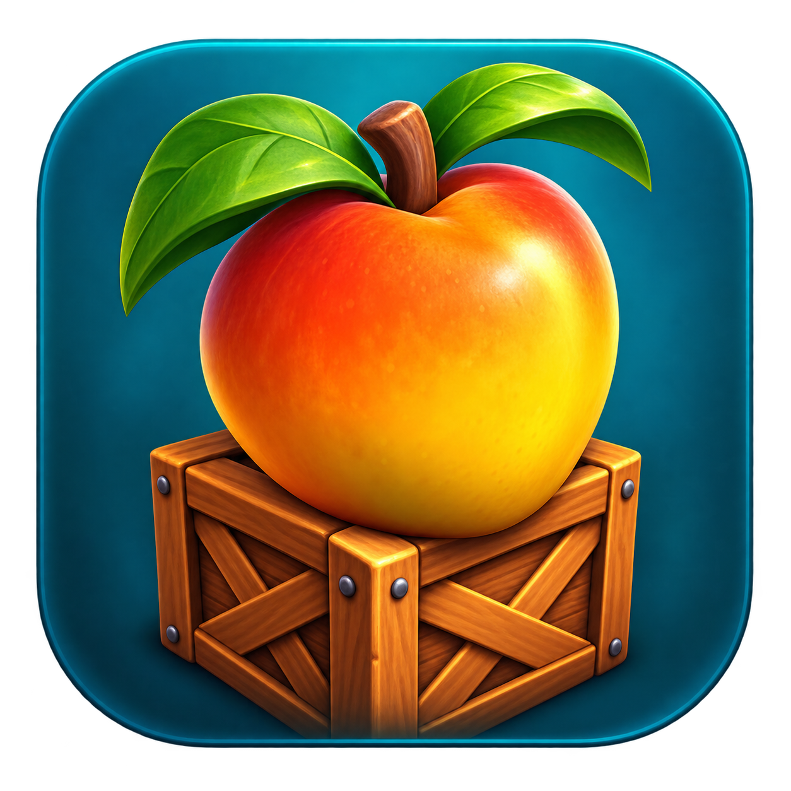

# WumpaForge



An experimental native Apple Silicon macOS port of **Crash Bandicoot: The Wrath of
Cortex**, built from your own original USA Xbox disc image. The original Xbox game
code is translated ahead of time to C and compiled to ARM64, with compatibility
layers for graphics, audio, input, and system calls. There is no CPU interpreter
or JIT fallback.

**Is this a decompilation or recompilation?** Primarily static recompilation:
machine-generated C carries the original game logic to ARM64. Reverse engineering
informs the compatibility code, but this is not a full reconstruction of the
game's original, readable source code.

The user has completed **Arctic Antics**, the first winter/penguin level. Bugs
remain, and the rest of the game has not been validated. The target is 60 FPS;
performance varies by scene and this is not a finished release. Development
evidence and known issues are in [STATUS](docs/STATUS.md); the
[development changelog](CHANGELOG.md) summarizes milestones. Intermittent story
visual artifacts remain; the latest hub-return crash fix has passed GPU tests
and awaits a full post-level return test. Physical Bluetooth controllers also
need testing on the actual hardware.

## Setup

You need an Apple Silicon Mac running macOS 14 or newer, Xcode Command Line Tools
(`xcode-select --install`), and native [Homebrew](https://brew.sh) at
`/opt/homebrew`. Run Terminal natively, without Rosetta. Install the build tools:

```sh
brew install gh python cmake sdl2 libepoxy pkg-config openssl@3
```

Python 3.11 or newer is required. This repository is currently private: your GitHub
account needs access, and `gh auth login` must succeed first. Obtain your own
original **USA Xbox** ISO; no game files or download links are provided here.
Other regions and console versions are unsupported. The setup script checks the
original executable's SHA-256 before extraction.

From the directory where you want the checkout, replace the quoted ISO path with
your own absolute path and run this one line:

```sh
gh repo clone pkyanam/WumpaForge && python3 WumpaForge/tools/setup.py "/absolute/path/Crash Bandicoot - The Wrath of Cortex (USA).iso"
```

Setup downloads the pinned xboxrecomp toolkit, applies this repository's patches,
creates a Python virtual environment, extracts and verifies your local game
files, generates the translated sources, builds with at most two compiler jobs,
and packages the app. The first build can take a while. The ISO is read-only and
can remain anywhere on your disk. Extraction and build products stay ignored by
Git. Keep several GB of free disk space for the assets, generated code and build.

To preview the steps without downloading, extracting, or compiling:

```sh
python3 WumpaForge/tools/setup.py --dry-run "/absolute/path/game.iso"
```

If you already cloned the repository, run `python3 tools/setup.py "/absolute/path/game.iso"`
from its root. Reruns preserve existing files and verify the extracted assets;
use a fresh checkout for a different disc image. A successful build does not
validate every level or feature.

## Play

Open `build/Wrath Native.app` inside the checkout, or run from its root:

```sh
open "build/Wrath Native.app"
```

The app currently uses a link to `local/assets` and local Homebrew libraries.
Keep the checkout and dependencies in place; the app is not a standalone,
redistributable bundle. **Extracted game assets are required at runtime.**
The bundle records the compiled binary's actual minimum macOS version; building
on a newer Mac does not automatically produce a binary for macOS 14. The current
development host runs macOS 26.6; other OS versions have not been tested.

Focus the game window, then use WASD to move, Space to jump/confirm, X or left
mouse to spin, C or right mouse to crouch/slide, and Enter to pause. The original
story can be watched or skipped with Space or Enter. From the first hub, walk
into portal 1 and wait to enter Arctic Antics. See [all controls](docs/CONTROLS.md).

Xbox One/Series and PS5 DualSense mappings use SDL's game-controller interface.
Pair the controller through macOS Bluetooth settings. Physical Bluetooth testing
for both controller families remains unverified; keyboard and mouse are available.

For QHD output, choose **Display → Window Size → 1440p** in the macOS menu bar.
Choose **Display → Sharpening → Medium** or **Strong** for a more visible filter.
The window title shows the measured output size and sharpening setting.

Resize or maximize normally; F11 (or Control–Command–F) toggles fullscreen and
F10 toggles the selected sharpening strength. A window-size preset exits
fullscreen. Fullscreen already scales to the display drawable; F10 changes the
filter, not the resolution. Internal rendering remains 640×480 with a 4:3 aspect
ratio, so upscaling sharpens existing pixels without adding new scene detail. See
[presentation details and limitations](docs/WINDOW-PRESENTATION.md).

## Development and AI agents

Setup composes the existing tools: `bootstrap.py`, the `prepare`, `assets`,
`analyze` and `lift` stages of `pipeline.py`, `verify_assets.py`, CMake, and
`package.py`. Pipeline diagnostics are written to `local/reports/`. Run
`python3 tools/setup.py --help` for options.

For CPU-only source regressions after setup, run `.venv/bin/python tools/check.py`.
See [testing instructions](docs/TESTING.md) for original-function checks, GPU/audio
fixtures, and the limits of source-based validation.

An AI coding agent is optional. Open this checkout in your agent, ask it to read
[AGENTS.md](AGENTS.md) and [STATUS](docs/STATUS.md), and give it the local ISO path
and a concrete task. For example: “Read AGENTS.md and STATUS.md, then help me run
the setup script with my ISO at `/absolute/path/game.iso`.” No agent subscription
or API key is required to build or play.

macOS Apple Silicon is the only platform with demonstrated gameplay. An isolated
[Shield Pro 2019 development build](android/shield2019/README.md) now produces an
Android ARM64 game library and TV APK; it has not been run on the device. Sharing
an ARM64 CPU does not establish operating-system, graphics or runtime compatibility. See the
[future portability notes](docs/PORTABILITY.md) and the focused
[SHIELD TV Pro 2019 plan](docs/ANDROID-TV-PLAN.md). The earlier [Android groundwork](android/README.md) remains available alongside
the new build and device-test instructions.

Game content, extracted executables, translated game sources, binaries, build
outputs, and dependency checkouts must stay out of commits. Upstream provenance
is recorded in [UPSTREAM](docs/UPSTREAM.md); see [third-party notices](THIRD_PARTY_NOTICES.md)
and the [licensing inventory](docs/LICENSING.md) before planning distribution.
The current implementation includes GPL/LGPL-covered components and is not offered
under a blanket proprietary license. Private source access does not grant rights
to redistribute the original game or its derived build products.
